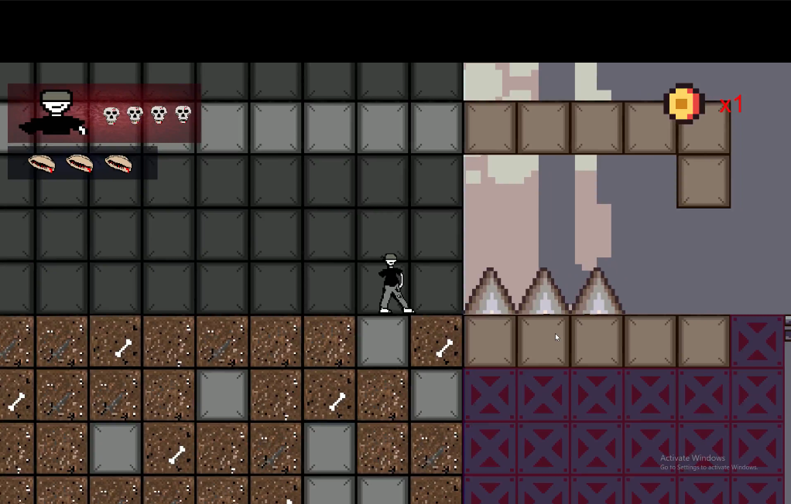
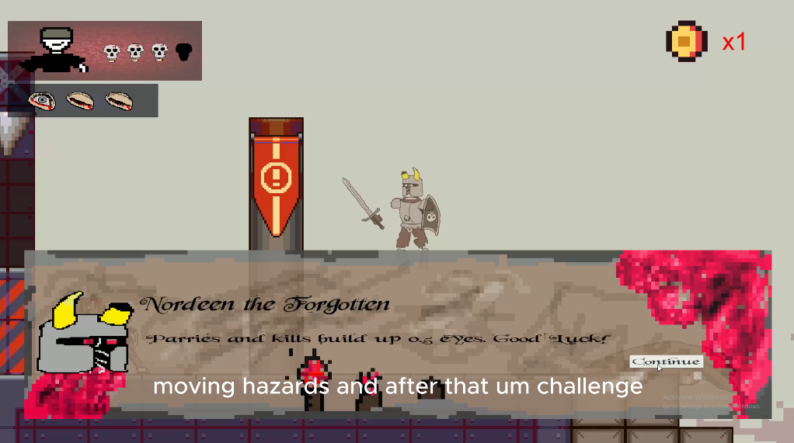
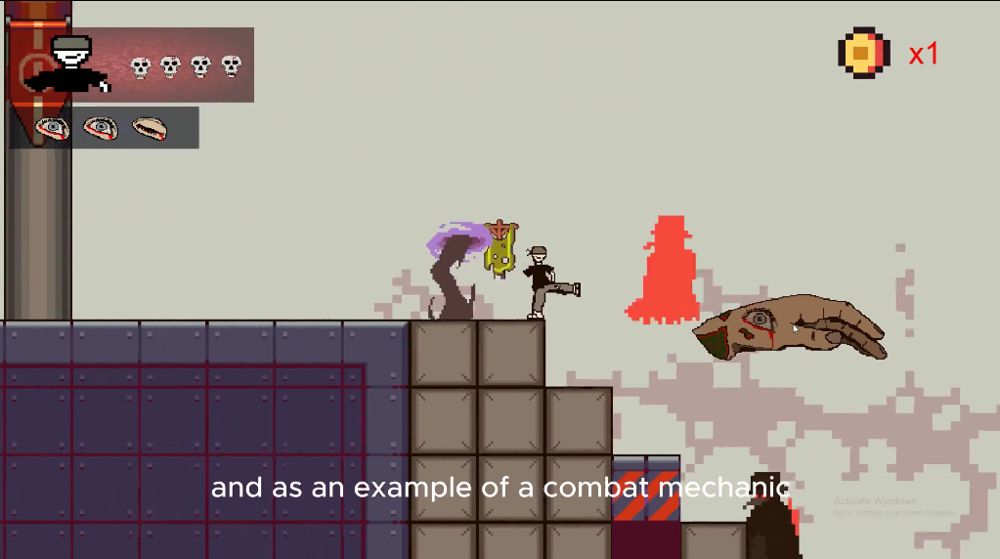
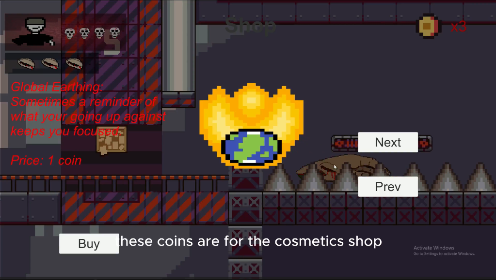
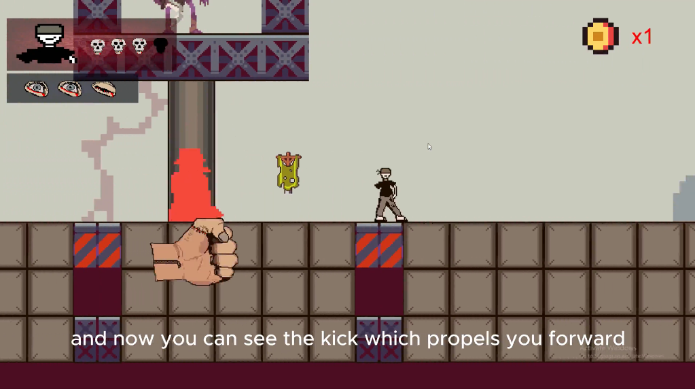
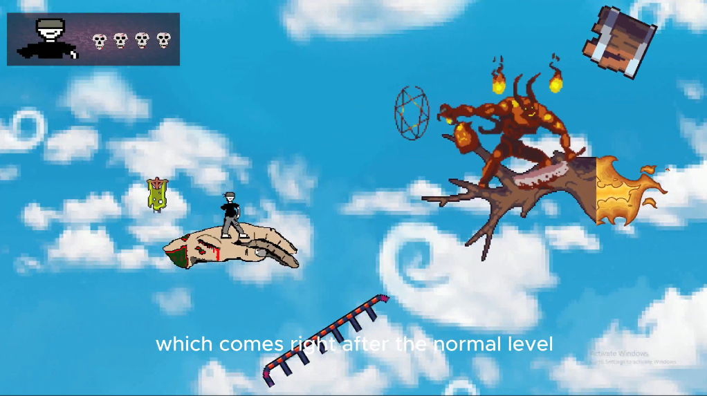

# 🌍 Possessed

## Overview

**Possessed** is a 2D Unity platformer focused on fast-paced movement, combat mechanics, and environmental storytelling centered around the fight against climate change.

Players battle through hazardous platforming sections, defeat corrupted enemies, and confront a climate-change-fueled demon in an aerial boss fight.

The game combines:
- Precision platforming
- Combat and defensive mechanics
- Enemy encounters
- Environmental hazards
- Boss fight gameplay
- Cosmetic progression
- Even some hand-drawn visuals

---

# 🎮 Gameplay Features

## Platforming

- Fast-paced 2D movement
- Precision jumping mechanics
- Environmental hazards and obstacles
- Momentum-based movement abilities

---

## Combat Mechanics

Players can:

- Kick enemies using directional attacks
- Parry incoming attacks
- Perform stronger jumps after crouching
- Dodge hazards during combat sections
- Use a special ability using the hand that follows the mouse pointer
---

## Enemy Types

### 🩺 Plague Doctor
A close-range melee enemy that aggressively chases the player.

### 👹 Ghoul
A hybrid enemy capable of both:
- Ranged attacks
- Close-range combat

---

## 🌪️ Boss Fight

The second stage features a flying boss battle against a **Climate Change Demon**.

Players must:
- Fly while navigating hazards
- Dodge falling environmental debris
- Attack the boss while maintaining movement control

---

# 🕹️ Controls

| Key | Action |
|---|---|
| `W` | Jump |
| `A / D` | Move Left / Right |
| `S` | Crouch |
| `Space` | Kick attack + horizontal dash |
| `C` | Parry |
| `Y` | Spend collected coins on cosmetics |
| `Right-click` | Use special ability to crush enemies via hand |

---

## Advanced Movement

### Charged Jump
Jumping after crouching (`S`) launches the player higher than a normal jump.

### Kick Dash
Using the kick attack shifts the player horizontally in the direction they are facing, allowing for:
- Faster traversal
- Combat mobility
- Gap clearing

---

# 📖 Tutorials

The game contains built-in tutorial sections introducing:
- Movement mechanics
- Combat controls
- Defensive abilities
- Advanced mobility techniques

---

# 🧩 Game Structure

## Stage 1 — Platforming Level

The first stage introduces:
- Core movement mechanics
- Environmental hazards
- Enemy encounters
- Combat tutorials

---

## Stage 2 — Boss Fight

The second stage transitions into:
- Flying gameplay
- Hazard dodging
- Boss combat mechanics
- Survival-focused gameplay

---

# 🛠️ Built With

- Unity
- C#
- 2D Physics System
- Unity Animation System

---

# ⚙️ Setup & Installation

## Requirements

- Unity `2022.3.19f1` recommended

---

## Clone Repository

```bash
git clone https://github.com/Konkz7/Unity-Possessed-Platformer
```

---

## Open in Unity

1. Open Unity Hub
2. Select **Add Project**
3. Choose the cloned repository folder
4. Open using Unity `2022.3.19f1`

---

# 🚀 Running the Game

After loading the project in Unity:

1. Open the main scene
2. Press the **Play** button in the Unity editor

---

# 📸 Screenshots

<p align="center">
  
</p>

<p align="center">
  
</p>

<p align="center">
  
</p>

<p align="center">
  
</p>

<p align="center">
  
</p>

<p align="center">
  
</p>

---

# 💡 What I Learned

This project helped develop experience with:

- 2D platformer physics
- Combat system design
- Enemy AI behaviours
- Boss fight design
- Player movement systems
- Unity animation systems
- Collision and hazard systems
- Game feel and movement balancing

---

# 🔮 Future Improvements

Potential future additions include:

- More levels and bosses
- Expanded enemy variety
- Save system
- Skill upgrades
- Additional cosmetic unlocks
- voice effects

---

# 👤 Author

Created by Amara Okonkwo.
